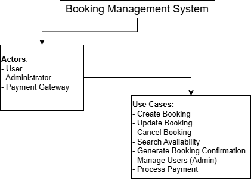

# Requirement Analysis in Software Development

## Introduction
This repository is dedicated to exploring the concept and process of **requirement analysis** in software development.  
Requirement analysis is a crucial phase in the Software Development Life Cycle (SDLC) where project needs are gathered, analyzed, and documented to ensure that the final product meets stakeholder expectations.

The purpose of this repository is to:
- Provide resources and examples related to software requirement analysis.  
- Demonstrate techniques for gathering, documenting, and validating requirements.  
- Serve as a reference for students, developers, and project managers involved in software projects.

Future updates will include sample requirement documents, use case templates, and best practices for managing software requirements effectively.

## What is Requirement Analysis?
**Requirement Analysis** is the process of identifying, understanding, and documenting what a software system should do to fulfill the needs and expectations of its users and stakeholders. It forms the foundation for all subsequent phases in the **Software Development Life Cycle (SDLC)** — such as design, development, testing, and deployment.

During this phase, project teams work closely with clients, end-users, and other stakeholders to gather detailed information about the system’s intended functions, constraints, and performance goals. This process ensures that the development team has a clear and shared understanding of the project objectives before any coding begins.

### Importance in the SDLC
Requirement Analysis is critical because:
1. **Prevents Miscommunication:** It ensures all stakeholders have a mutual understanding of what the system will achieve.  
2. **Guides Design and Development:** Clear requirements serve as a blueprint for developers and designers to build the right system.  
3. **Reduces Costs and Rework:** Early identification of incorrect or incomplete requirements helps avoid costly changes during later stages.  
4. **Improves Quality:** Well-defined requirements lead to better testing and validation, resulting in a higher-quality end product.

## Why is Requirement Analysis Important?

Requirement Analysis plays a vital role in ensuring project success within the SDLC. Below are key reasons why it is essential:

### 1. Ensures Clear Understanding of Project Goals
By documenting and analyzing requirements, all stakeholders — including clients, developers, and designers — gain a unified understanding of what the system must accomplish. This reduces ambiguity and aligns the project team with business objectives.

### 2. Minimizes Development Risks and Costs
Thorough requirement analysis helps identify potential issues early in the development process. Detecting problems at this stage is far less costly than discovering them after implementation, reducing rework and saving valuable time and resources.

### 3. Enhances Product Quality and User Satisfaction
A well-analyzed set of requirements ensures the product is designed to meet user needs and perform as expected. This leads to better usability, higher customer satisfaction, and fewer post-deployment issues.
5. **Ensures Stakeholder Satisfaction:** By aligning the final product with user needs, requirement analysis ensures the system delivers real business value.

## Key Activities in Requirement Analysis

The requirement analysis process involves several key activities that ensure the project requirements are well-understood and clearly documented:

- **Requirement Gathering:**  
  Collecting all relevant information from stakeholders, users, and existing systems to understand what is needed in the new software system.

- **Requirement Elicitation:**  
  Engaging stakeholders through interviews, questionnaires, workshops, and observations to extract detailed requirements that may not be immediately obvious.

- **Requirement Documentation:**  
  Recording the gathered and elicited requirements in a structured and organized manner, using formats such as Software Requirement Specifications (SRS), use cases, and user stories.

- **Requirement Analysis and Modeling:**  
  Analyzing requirements for completeness, consistency, and feasibility, and creating models (like flowcharts, ER diagrams, and UML diagrams) to represent system behavior and data.

- **Requirement Validation:**  
  Reviewing and verifying requirements with stakeholders to ensure they are accurate, feasible, and aligned with business goals, and making necessary adjustments before development begins.

## Types of Requirements

Requirement analysis typically classifies requirements into **Functional** and **Non-functional Requirements**. Both are essential for developing a complete and user-friendly system.

### Functional Requirements
**Definition:** Functional requirements describe **what the system should do**, specifying the behavior, features, and functions of the software. They define the interactions between the system and its users.

**Examples for a Booking Management Project:**
- Users must be able to create, update, or cancel bookings.  
- The system should automatically generate booking confirmations and send email notifications.  
- Administrators must be able to manage user accounts and access permissions.  
- The system should display available slots and prevent double-booking.  

### Non-functional Requirements
**Definition:** Non-functional requirements describe **how the system should perform**. They define quality attributes, constraints, and standards that the system must meet, rather than specific behaviors.

**Examples for a Booking Management Project:**
- The system should support at least 500 concurrent users without performance degradation.  
- Response time for booking requests should not exceed 2 seconds.  
- The system must ensure secure storage of user data according to GDPR standards.  
- The application should be compatible with major browsers and mobile devices.

## 🎯 Use Case Diagrams

### What are Use Case Diagrams?
A **Use Case Diagram** is a visual representation of the interactions between **actors** (users or external systems) and the system under development.  
It helps capture the functional requirements of a system by illustrating who performs what actions and how the system responds.

**Benefits of Use Case Diagrams:**
- Provides a clear overview of system functionality from a user perspective.  
- Helps identify all actors and the scope of interactions.  
- Supports requirement validation and communication with stakeholders.  
- Serves as a foundation for creating detailed use cases and functional specifications.

### Use Case Diagram for the Booking System
In a **Booking Management System**, the key actors and use cases might include:

**Actors:**
- **User**: Registers, logs in, searches available slots, makes bookings, updates or cancels bookings.  
- **Administrator**: Manages users, oversees bookings, generates reports.  
- **Payment Gateway**: Processes payments securely.  

**Use Cases:**
- Create Booking  
- Update Booking  
- Cancel Booking  
- Search Availability  
- Generate Booking Confirmation  
- Manage Users (Admin)  
- Process Payment  

**Diagram:**  

## Acceptance Criteria

### What is Acceptance Criteria?
**Acceptance Criteria (AC)** are specific conditions that a software product must satisfy to be considered complete and acceptable by stakeholders.  
They define the **expected behavior** of a feature and provide a clear benchmark for developers and testers to validate functionality.

**Importance in Requirement Analysis:**
- Ensures clarity between stakeholders, developers, and testers about what “done” means.  
- Helps prevent misunderstandings and reduces rework.  
- Guides testing and quality assurance by providing measurable validation points.  
- Supports project planning and feature prioritization.

### Example: Checkout Feature in a Booking Management System
**Feature:** Checkout  
**Acceptance Criteria:**
1. The user must be able to select a payment method (Credit Card, PayPal, or Mobile Money).  
2. Payment information must be validated before processing.  
3. Upon successful payment, a booking confirmation message must be displayed.  
4. A confirmation email should be sent to the user within 5 minutes of completing the transaction.  
5. If payment fails, an appropriate error message should be displayed, and the user must be able to retry payment.
